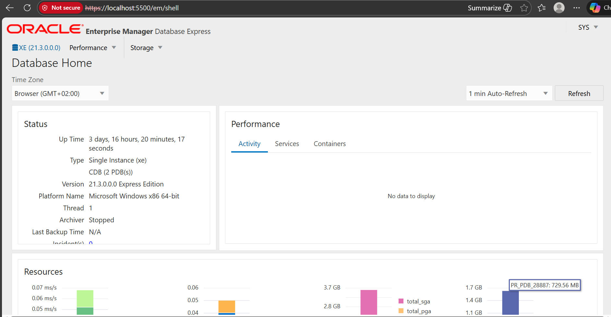

# Oracle Pluggable Databases (PDB) Management 
**Name:** BIKARI Prince

**ID:** 28887

**Group:** Thursday Grp D

## Table of Contents
1. [Overview](#1-overview)
2. [Oracle Environment Used](#2-oracle-environment-used)
3. [Task 1: Creation of New Pluggable DataBase](#3-task-1-creation-of-new-pluggable-database)
4. [Task 2: Temporary PDB Creation and Deletion](#4-task-2-temporary-pdb-creation-and-deletion)
5. [Task 3: Oracle Enterprise Manager (OEM)](#5-task-3-oracle-enterprise-manager-oem)
6. [Challenges Faced and Solutions](#6-challenges-faced-and-solutions)
7. [Integrity Statement](#7-integrity-statement)
8. [Final Checklist](#8-final-checklist)

# 1. Overview
This repository provides practical evidence for Assignment II on Oracle Multitenant Architecture. The project involved creating, managing, and deleting Pluggable Databases (PDBs) and users in the Oracle 21c environment, with a focus on developing hands on administrative skills, including PDB lifecycle management, user creation, and monitoring through Oracle Enterprise Manager (OEM). All tasks were completed individually and documented with supporting screenshots.

# 2. Oracle Environment Used
**Database Version:** Oracle Database 21c Express Edition (XE)

**Tool:** Oracle SQL Developer (24.3) / SQL*Plus

**OS:** Windows 11

**Browser:** Microsoft Edge (for OEM)
# 3. Task 1: Creation of New Pluggable DataBase
We were required to create the user that we will be using in our future class.

**Action:**

   PDB Name Created :  `pr_pdb_28887`
   
   Created User: `prince_plsqlauca_28887`
   
   Granted Privileges: `CONNECT`, `RESOURCE`, `DBA`

  ## Evidence Required
We used the above names as we were required to use them in our work the following is to show what we have created as the evidence of screenshots.
 ### PDB creation command

### PDB open state

### User created inside the PDB
Where the user was granted all permissions.

**Status:** Task 1 has been completed. Where PDB is open and user is active.

# 4. Task 2: Temporary PDB Creation and Deletion
The temporary PDB was created using the specified naming convention for deletion practice.

**Action:**

   Created a temporary PDB named: `pr_to_delete_pdb_28887`
   
   Verified its existence in `v$pdbs`.
   
   Dropped the PDB including datafiles.
 ## Evidence Required
These are the following screenshots showing the temporary PDB creation and deleting it with showing the commands used and it's verification.

### Creation of Temporary PDB Name

### Verification of Temporary PDB

### Deleting the PDB completely including all datafiles

# 5. Task 3: Oracle Enterprise Manager (OEM)
Configure and access the web based management dashboard were done successfully.

 **Action:**
 
   Verified the HTTPS port (5500).
   
   Logged into `https://localhost:5500/em` as `SYS` 
   and the other screenshot the first one shows the username is visible under our creation of PDB.
   
   Verified the PDB `pr_pdb_28887` is visible in the dashboard containers.
   
   ### Dashboard Evidence
   
   

   
 

# 6. Challenges Faced and Solutions
During this assignment, I have faced some challenges and i have tried to tackle and i get the solution;

| Challenge / Error | Solution Applied |
| :--- | :--- |
| **ORA-65016: FILE_NAME_CONVERT must be specified** | The database did not know where to store the new PDB files. I resolved this by creating a directory `C:\oracle_pdbs` and running `ALTER SYSTEM SET db_create_file_dest = 'C:\oracle_pdbs' SCOPE=BOTH;` to enable Oracle Managed Files (OMF). |
| **ORA-01031: insufficient privileges** | I firstly tried to open the PDB using the `SYSTEM` user with default roles. I resolved this by reconnecting using the `SYS` user with the `SYSDBA` role. |
| **ORA-01917: user does not exist (during Grant)** | I attempted to run the `GRANT` command before the `CREATE USER` command had fully processed. I resolved this by highlighting both commands and running them strictly in sequence. |

**NB:** When going to run your commands you must select them all before you hit run button because it is good it can cause some problems.

# 7. Integrity Statement
I declare that this assignment is my own work. I have followed the naming conventions exactly as required and have not copied from peers. As a future database professional,  precision, discipline, and integrity are non-negotiable. My reputation depends on being honest, producing quality work, and taking 
responsibility for everything I do.

# 8. Final Checklist

- [X] Correct PDB names used  
- [X] User created inside the PDB  
- [X] Temporary PDB created and deleted  
- [X] OEM dashboard screenshot included  
- [X] GitHub repository is PUBLIC  
- [X] README is clear and professional  
- [X] Deadline respected

Excellence is never an accident; it is the result of discipline, commitment, and integrity.

